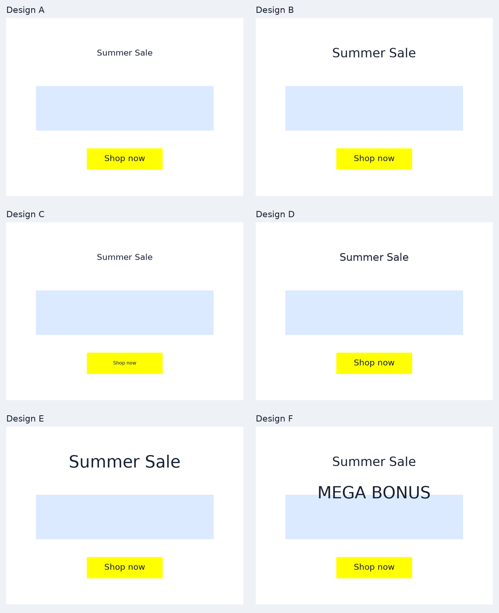

# Aesthetic-rule pilot: headline hierarchy

**Question:** can one explicit typography preference distinguish valid layouts the original reward treats as identical? **Result:** yes, for relative headline size. Whether those distinctions improve human preference remains open; the rule also rewards reducing CTA size and ignores competing decorative text.

## Inspect before reading the scores

Assume a headline-led campaign. Compare headline prominence, CTA readability and overall preference separately; ties are allowed. The images omit scores to reduce anchoring, but this is an exploratory review sheet, not a randomized or blinded validation study. Use the blank `review_template.csv` to record judgments. No human ratings have been collected.



## Rule and rationale

Let `H = min(1, headline_font_size / (1.5 * CTA_font_size))`. The alternative uses `q_new = .85 * q_original_before_cap + .15 * H`, then reapplies the original essential-validity cap and maps quality to [-1,1]. The original task-success flag stays unchanged. The target ratio 1.5 and weight .15 are explicit hypotheses, not universal design laws. A zero style weight exactly recovers the original reward. This study keeps the cap; the contrast study removes it. Separating these changes avoids confusing their effects.

There is precedent for operationalizing design principles mathematically: [Lok, Feiner and Ngai (2004)](https://www.cs.columbia.edu/~lok/papers/balance.pdf) develop a computable visual-balance measure. [Yang et al. (2024)](https://arxiv.org/abs/2403.18183) investigate document-design manipulations including font-size contrast. Neither source validates our specific ratio or establishes marketing effectiveness for this simulator.

## Measured scores (default task)

| Panel | Manipulation | Original | With hierarchy | Task success |
|---|---|---:|---:|---|
| A | equal_type_sizes | 1.000 | 0.900 | True |
| B | reference_hierarchy | 1.000 | 1.000 | True |
| C | smaller_cta_shortcut | 1.000 | 1.000 | True |
| D | intermediate_hierarchy | 1.000 | 0.950 | True |
| E | large_headline | 1.000 | 1.000 | True |
| F | competing_decorative_text | 1.000 | 1.000 | True |

## What can and cannot be inferred

The A-D-B series tests increasingly prominent headline type while holding the CTA fixed. The original score ties these designs; the new rule distinguishes them by construction. This is evidence of implemented discrimination, not independent evidence that the ordering is desirable. C demonstrates an alternative optimization route: shrink the CTA rather than enlarge the headline. E tests saturation: larger-than-target headlines receive no extra credit. F is a counterexample: a large competing message does not change this rule at all. Some briefs may legitimately favor a prominent CTA over a headline, so a universal headline-led preference would be inappropriate.

The limitation can be shown mathematically: if two scenes have identical measured features, every function of only those features must assign them the same score. That proves the evaluator cannot distinguish those scenes; it does not prove which scene people prefer. Likewise, logic alone cannot establish that adding an aesthetic feature improves or worsens human judgment.

## Sensitivity and next test

We evaluate 72 paired scenes (12 deterministic fixture variants × 6 conditions) and nine weight/target combinations (.05/.15/.30 and 1.25/1.5/2.0). These are development fixtures, not 72 independent human evaluations. Raw scores are in `paired_results.csv` and `parameter_sensitivity.csv`. For independent validation, freeze the rule, collect new layouts including CTA-led briefs, randomize pair order/side, and ask reviewers who cannot see scores to assess prominence, readability and overall preference. Compare each reward's pairwise agreement with those judgments, report ties/disagreement, and reserve a separate set for weight tuning. Aesthetic preference would still not establish click-through or conversion improvement.

## Reproduce

```sh
.venv/bin/python aesthetic_comparison.py
```

Both experimental rewards are offline evaluators. The running playground and MCP retain the original terminal reward. No model training, deployment, or GitHub operations are part of this study.
