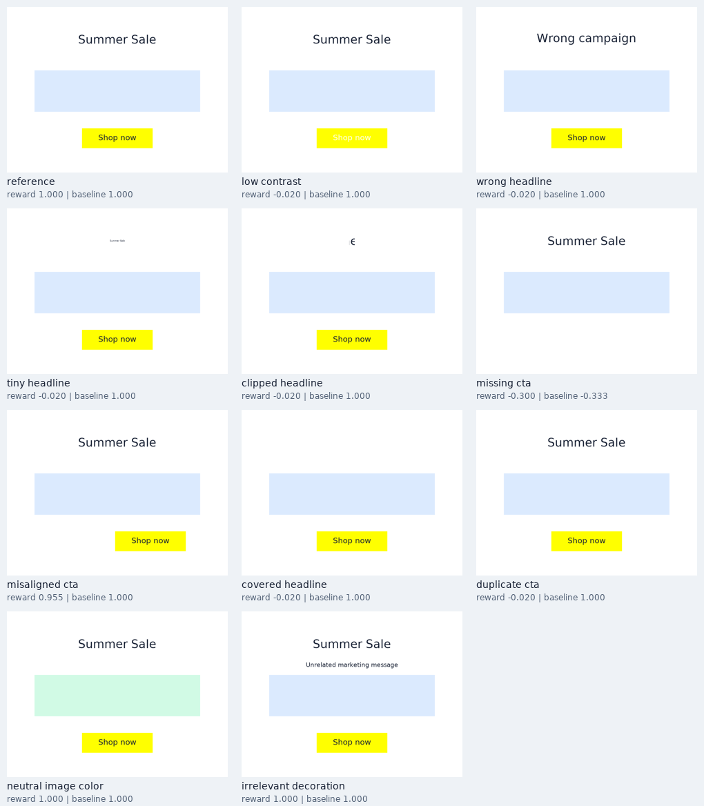

# Evaluator mini-experiments

These are controlled tests of a reward proxy. No LLM was run or trained.

## Design

12 deterministic fixture variants × 11 conditions = 132 evaluated canvases. Variants change headline, CTA wording, heading position, and button width. Each intervention is paired with its own reference. Seeds label fixture variants; transitions contain no randomness. The cases were designed alongside the evaluator and are development checks, not an independent test set. No p-values or population-level confidence intervals are claimed.

## Results

| Condition | Mean reward | Presence-only baseline | Expectation |
|---|---:|---:|---|
| reference | 1.000 | 1.000 | equal |
| low_contrast | -0.020 | 1.000 | decrease |
| wrong_headline | -0.020 | 1.000 | decrease |
| tiny_headline | -0.020 | 1.000 | decrease |
| clipped_headline | -0.020 | 1.000 | decrease |
| missing_cta | -0.300 | -0.333 | decrease |
| misaligned_cta | 0.955 | 1.000 | decrease |
| covered_headline | -0.020 | 1.000 | decrease |
| duplicate_cta | -0.020 | 1.000 | decrease |
| neutral_image_color | 1.000 | 1.000 | equal |
| irrelevant_decoration | 1.000 | 1.000 | limitation_probe |

Directional/invariance checks: **120/120**. The presence-only baseline reduces reward for **1/8** defect families; its simplicity is intentional and it is not a competitive state-of-the-art baseline.



## Interpretation and unresolved failures

The structured evaluator catches explicit content errors, poor contrast, clipping, small text, occlusion, duplicates, and misalignment in these fixtures. The neutral image recoloring leaves reward unchanged. However, unrelated extra text still receives full reward. The reward validates required content and basic layout, not persuasion, overall composition, image relevance, or every decorative text element. Counting these checks as model generalization results would be incorrect.

The contrast sweep reveals a deliberate discontinuity: essential-constraint failures cap quality at 0.49 (reward -0.02), so the final reward can jump when contrast crosses the threshold. Component scores retain more detail but are diagnostic only. This protects validity at the cost of a less informative terminal learning signal. The alignment sweep is graded. Neither sweep demonstrates learning efficiency.

## Local microbenchmark

One process, three elements, 800×600 RGB; 30 timed repetitions after one warm-up per operation. These are local timings, not a distributed throughput forecast. Step timings would also include optional trajectory copying and terminal evaluation.

| Operation | Median ms | p95 ms |
|---|---:|---:|
| observe | 0.006 | 0.006 |
| json_serialization | 0.011 | 0.011 |
| render | 0.673 | 0.742 |
| evaluate_uncached | 3.185 | 3.309 |

## Next experiment

Ask independent reviewers to compare new, held-out canvas pairs without seeing the reward. Separate task correctness, readability, and aesthetic preference. Measure rubric agreement and inspect disagreements with the heuristic before tuning weights. Then test a fixed LLM on repair tasks under a fixed action budget; compare terminal-only feedback with diagnostic feedback while keeping model, prompts, and task variants fixed. Agent behavior and reward validity are distinct studies.

## Reproduce

```sh
python experiments.py --seeds 12
```

See `paired_results.csv`, `contrast_sweep.csv`, `alignment_sweep.csv`, and `metadata.json` for raw results and environment versions.
