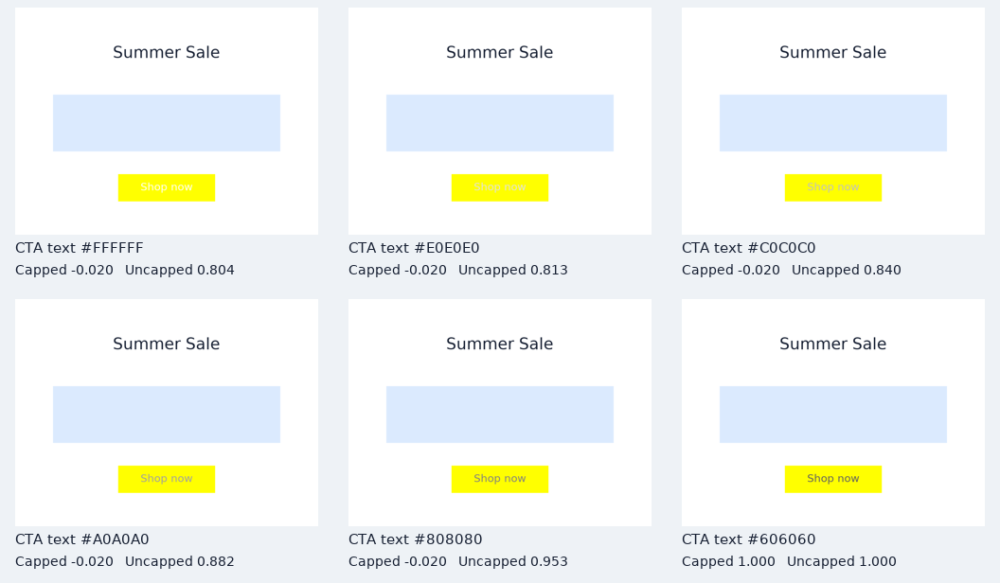

# Reward comparison: can a score reflect incremental progress?

**Finding:** removing the validity cap reveals gradual contrast improvements, but allows high scores for invalid designs. Neither reward measures excellent marketing design.

## Method

The baseline is `capped_v1`; `uncapped_v1` removes only its essential-validity cap. Both use the same rendered measurements and weights: 45% constraints, 20% visibility, 20% contrast, 15% layout. We rescore identical scenes, keeping task success as an independent, unchanged outcome. The uncapped reward is graded in contrast and alignment, not globally continuous: exact text/color, visibility and spacing still have thresholds.

We evaluate 132 paired development fixtures (12 deterministic variants × 11 conditions), all 256 grayscale CTA text colors, 17 headline font sizes, and one nonoverlapping duplicate-CTA counterexample. A separate six-state repair sequence shows how score evolves through actual edits. No model is run or trained. These cases were selected with knowledge of the reward and are not independent evidence of human design preference or learning efficiency.

## Gradual contrast repair

Only CTA text color changes. The headline, yellow button, position and task stay fixed.

| CTA text | Capped | Uncapped | Task success |
|---|---:|---:|---|
| #FFFFFF | -0.020 | 0.804 | False |
| #E0E0E0 | -0.020 | 0.813 | False |
| #C0C0C0 | -0.020 | 0.840 | False |
| #A0A0A0 | -0.020 | 0.882 | False |
| #808080 | -0.020 | 0.953 | False |
| #606060 | 1.000 | 1.000 | True |



Of 141 adjacent increases in measured contrast below 4.5:1, the capped score increases 0 times; the uncapped score increases 141 times. Pairs are ordered by measured contrast, not grayscale value. This is a deterministic sensitivity check, not a statistical sample. Above the threshold, the contrast component saturates intentionally.

## Costs and counterexamples

Among 84 fixtures with essential failures, the capped reward gives 0 positive scores; the uncapped reward gives 72. Positive is not synonymous with valid; success must be reported separately.

A second CTA placed below the original, without covering it, scores **1.000 uncapped versus -0.020 capped**, despite violating uniqueness. Uniqueness is represented by the cap, not a separate weighted component, so removing the cap removes that penalty entirely. The font sweep also retains a plateau below 16 pixels. Both versions still award full credit to unrelated extra copy. The ablation therefore supports a narrower conclusion than 'the new reward is better'.

## Score, progress, and training are different

This experiment is offline rescoring. The playground, MCP and `env.step` continue to use the original capped terminal reward. `repair_trajectory.json` records zero intermediate rewards and the baseline terminal reward; alternative previews are in `repair_scores.csv`. To use the alternative in a future trainer, select it at episode reset, keep it fixed through the episode, evaluate it at termination, and log its version/configuration. That rollout integration is not implemented here.

A final reward can depend on all accumulated design improvements without paying reward on every action. Naively summing positive improvements lets an agent damage and repair the same element repeatedly. Potential-based shaping instead adds `gamma * Phi(next_state) - Phi(state)` to the original reward, with zero terminal potential for this episodic formulation and the same discount as the trainer. This preserves the underlying return ordering under the relevant assumptions; replacing the terminal objective with our uncapped score does not. Shaping is not implemented. See [Ng et al., 1999](https://ai.stanford.edu/~ang/papers/shaping-icml99.pdf).

## Reproduce

```sh
.venv/bin/python reward_comparison.py --seeds 12
.venv/bin/python replay.py results/reward-comparison/repair_trajectory.json
```

Raw CSV files, a counterexample scene, trajectory, and source/dependency metadata accompany this report. Use `--output` for a separate run directory. See [the research notes](../../RESEARCH_NOTES.md) for human validation and prospective training design.
